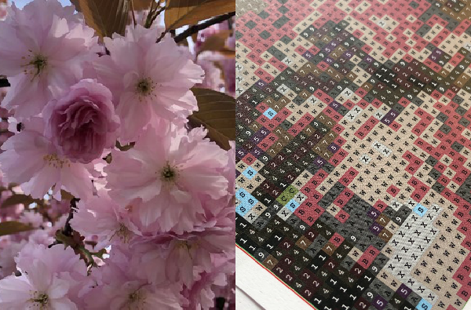

# Diamond Imager

 🚧 

 **This project is currently in active development.** 

 Expect breaking changes and unfinished features. 

 🚧 

Rust & Axum web app to process images into Diamond Painting projects ready to be printed.

  

  <em> Example of printed output </em>

## Flow idea
1. **User uploads image**:
  - Image is stored as-is
  - User gets a UUID
  - Image is accessible for a limited time
2. **User request one of DMC palettes**:
  - Full DMC palette
  - Subset of colors most representative of the uploaded image
3. **User loops**:
  - Optionally modify the palette manually or re-extract subset
  - Adjust color manipulation parameters
  - Crop/rotate the image
  - Request preview
  - Generate final PDF

## Endpoints
| Method | Route | Effect | Implemented |
|---|---|---|---|
| POST | /image | Upload image obtain UUID | Y |
| GET | /image/{uuid} | Get image metadata (e.g., upload time, resolution) | n |
| DELETE | 	/image/{uuid} | Delete uploaded image manually | n |
| GET | /palette/dmc | Get full DMC list | Y |
| GET | /palette/auto/{uuid} | Get auto-generated palette subset based on image | n |
| POST | /palette/custom/{uuid} | Submit a custom palette (client-chosen subset) | n |
| POST | /image/{uuid}/transform | Crop/rotate/adjust brightness/contrast | n |
| GET |	/preview/{uuid} | Generate and return a preview image (e.g., PNG/JPEG) | n |
| POST | /pdf/{uuid} | Generate and return the final printable PDF | n |
| GET | /pdf/{uuid} | 	Download the generated PDF | n |
| GET | /status/{uuid} | 	Check processing status (useful for async steps) | n |

## Todo
- [x] Proof of concept
- [x] Basic image upload with UUID return
- [x] Store images temporarily with expiration
- [x] DMC full palette support
- [x] Automatic DMC palette extraction from image
- [ ] Manual palette editing interface
- [ ] Image preview generation
- [ ] Image manipulation:
  - [ ] Crop
  - [ ] Rotate
  - [ ] Brightness/contrast adjustments
- [ ] Debounced real-time preview updates (client or server)
- [x] PDF generation with DMC color grid
- [ ] API route documentation
- [ ] Client-side frontend (Wanna try WASM)
- [ ] Style output for printing (grid size, margins, legend)
- [ ] Image cleanup job (periodic deletion of expired images)
- [ ] Consider user accounts (Diesel ORM & Postgress)
- [ ] Deployment setup (Docker, hosting config)
- [ ] Add tests (unit & integration)
- [ ] CI pipeline (formatting, clippy, tests)